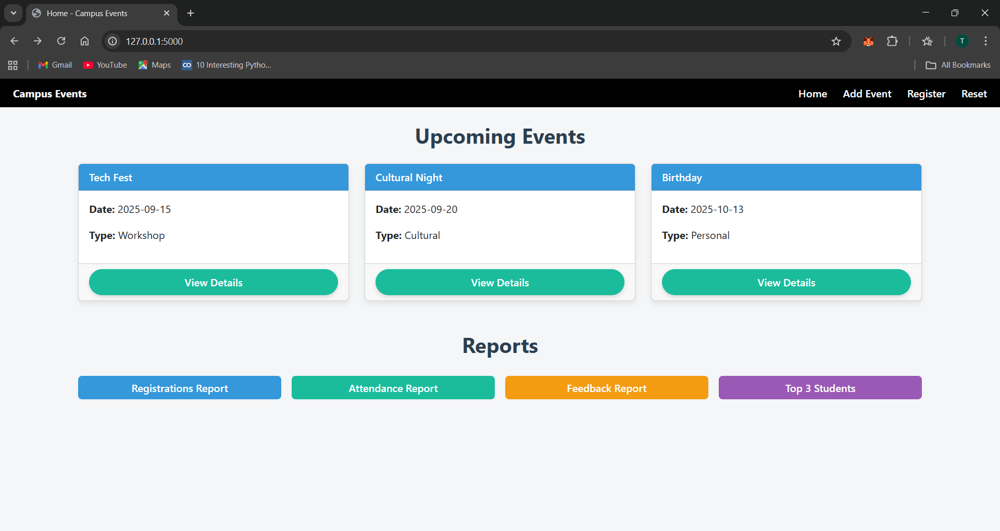
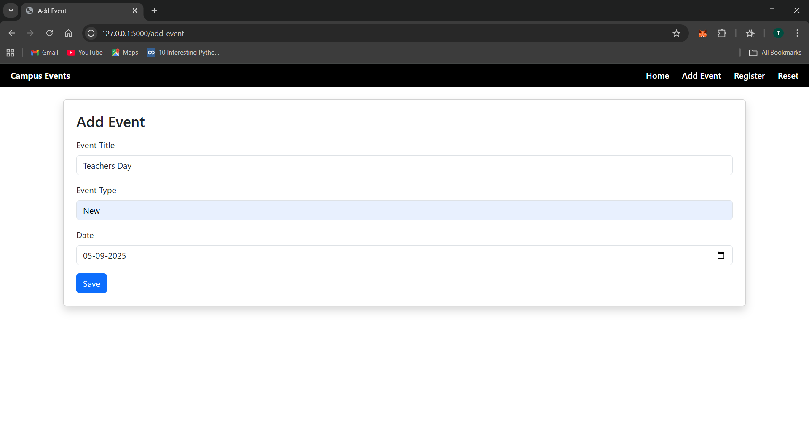
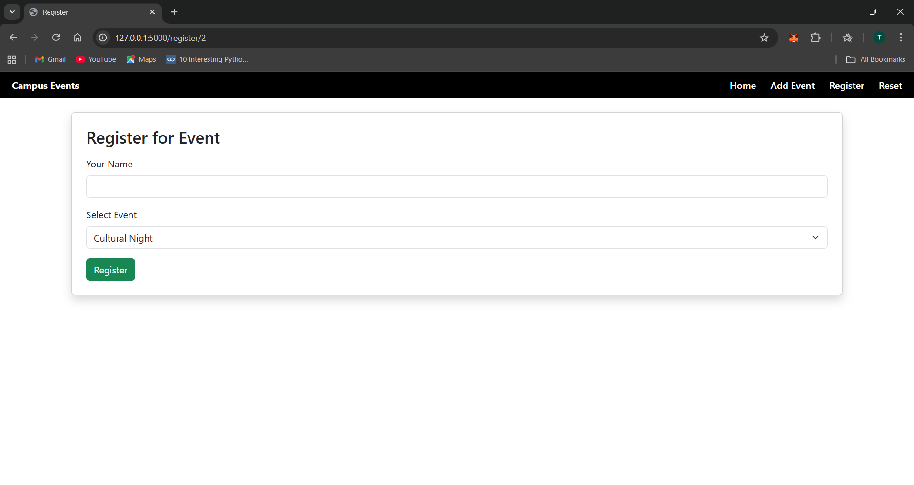
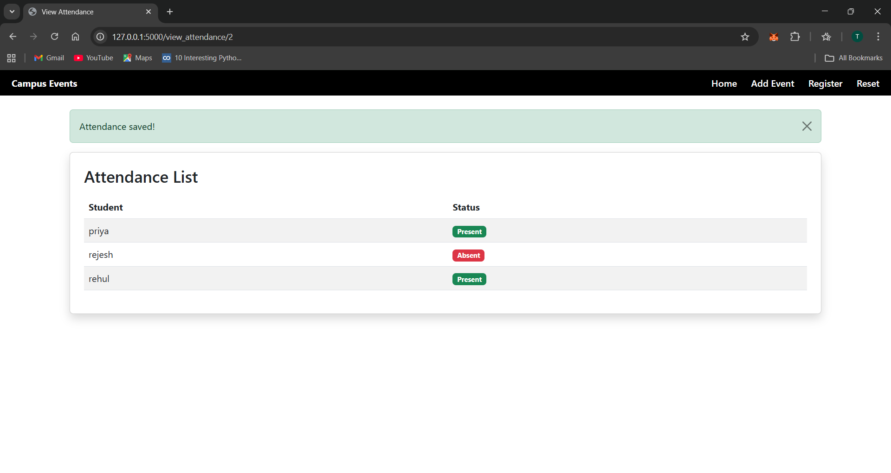

# Campus Event Management System
-it is built with Python Flask and SQLite to manage events, registrations, mark attendance, submit feedback and create new events.
-It generates reports for event organizers where they can check Registrations Report, Attendance Report, Feedback Report and view top 3 students with highest attendance
## Features
### Event Management:
-Add, view, and manage campus events.
-Events include details such as title, type (Workshop, Cultural, etc.), and date.
### Student Registration:
-Students can register for events.
-Admin can see which students have registered for which event.
### Attendance Tracking:
-Mark attendance for each student.
-attendance reports can be viewed in percentage for each event.
### Feedback System:
-Students can submit ratings for events.
-organizers can view feedbacks in home page by clicking on feedback reports.
### Reports:
-Registrations Report: Shows how many students are registered for each event.
-Attendance Report: Calculates the attendance percentage per event.
-Feedback Report: Shows average ratings for events.
-Top Students Report: List of students with highest attendance across events.

## Technologies Used:
-Backend: Python, Flask
-Database: SQLite
-Frontend: HTML, CSS, Bootstrap
-Templating: Jinja2

## How to Use
1. Admin can create events via the "Add Event" page.
2. Students can browse and register for events.
3. Admin can mark attendance on the day of the event.
4. Students can submit feedback after attending.
5. Organizers can view reports on registrations, attendance, feedback, and top students.

## Instalation and Setup
1. Clone the repository 
git clone https://github.com/Tasmia-create/Campus-Event-Assignment.git
cd CAMPUS_EVENT_ASSIGNMNET
cd campus_event_prototype

2. Create Virtual Environment:
python -m venv venv

3. Activate virtual environmnet:
-on windows:
venv\Scripts\activate

-on mac/linux:
source venv/bin/activate

4. Install packages:
pip install -r requirements.txt

(if requirements.txt is not visible or provided you can install flask manually by using command :
pip install flask).

5. Run application:
command:
python app.py

open in browser:
http://127.0.0.1:5000/

### Database:
-Uses SQLite database named database.db.
-Database will initialize automatically when running the app if database.db does not exist.

## Screenshots:
1. Home page:

2. Add Event Page:

3. Registration page:

4. Attendance Page:

## Author:
Tasmia S
-B.Tech CSIT Student (7th semester).